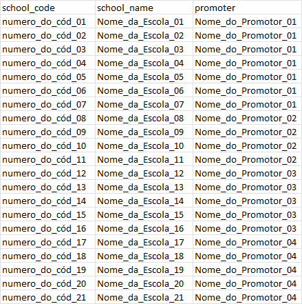

# Cortesias Enviadas - Automação de Relatórios

Este projeto consiste em um script Python que automatiza a organização e geração de relatórios a partir de arquivos armazenados em uma pasta. Ele foi desenvolvido para otimizar um processo manual, transformando dados brutos em uma planilha estruturada e pronta para análise.

## Funcionalidades

- Lista arquivos de uma pasta específica.
- Processa os arquivos para extrair informações relevantes.
- Gera um relatório em formato Excel com os dados organizados.
- Utiliza um banco de dados de escolas (em formato JSON) para enriquecer os dados processados.

## Como funciona

O script faz o seguinte:
1. **Lista os arquivos**: Varre uma pasta em busca de arquivos relevantes.
2. **Processa os arquivos**: Extrai informações como código da escola, ano e páginas.
3. **Consulta o banco de dados**: Usa um banco de dados de escolas (em JSON) para adicionar detalhes como nome da escola e promotor.
4. **Gera o relatório**: Cria uma planilha Excel com os dados processados.

## Pré-requisitos

Para executar este script, você precisa ter instalado:
- Python 3.x
- Bibliotecas Python: `pandas`, `openpyxl`

Instale as dependências com o seguinte comando:
```bash
pip install pandas openpyxl
```
Ou se preferir, use o arquivo `requirements.txt`
```bash
pip install -r requirements.txt
```

## Como usar

1. Clone este repositório:
   ```bash
   git clone https://github.com/huannvictor/cortesias-enviadas.git
   cd cortesias-enviadas
   ```

2. Configure os caminhos no script:
   - `DIRECTORY`: Caminho da pasta onde estão os arquivos.
   - `SPREADSHEET_PATH`: Caminho onde o relatório será salvo.
   - `DATABASE_SPREADSHEET`: Nome do arquivo Excel que contém o banco de dados das escolas.

3. Execute o script:
   ```bash
   python script.py
   ```

4. O relatório será gerado no caminho especificado em `SPREADSHEET_PATH`.

## Estrutura do Projeto

```
cortesias-enviadas/
├── script.py              # Script principal
├── db_schools.json        # Banco de dados das escolas (gerado a partir do Excel)
├── database.xlsx          # Arquivo Excel com os dados das escolas
├── README.md              # Este arquivo
└── requirements.txt       # Lista de dependências
```

## Exemplo de Uso

1. Coloque os arquivos a serem processados na pasta especificada em `DIRECTORY`.
2. Certifique-se de que o arquivo `database.xlsx` contém os dados das escolas.
3. Execute o script e verifique o relatório gerado.

## Prints

<div align="center">
  
  <p align="left">
    Esta é uma pasta com os arquivos a serem listados e irão compor o relatório em excel.
  </p>
</div>
</br>
<div align="center">
  
  <p align="left">
    Esta é uma planilha com uma relação de escolas com o código, nome da escola e o responsável (promoter) por ela.</br>
    Será usada para alimentar o relatório final.
  </p>
</div>
</br>
<div align="center">
  
  <p align="left">
    Esta é a planilha já finalizada alimentada com a relação dos arquivos referentes ao ano de 2025 já atribuídas em cada seu nome e promotor.</br>
  </p>
</div>
</br>

## Licença

Este projeto está licenciado sob a [MIT License](LICENSE).